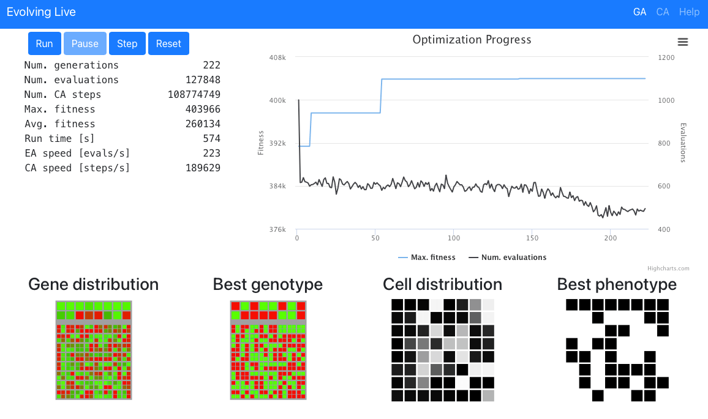
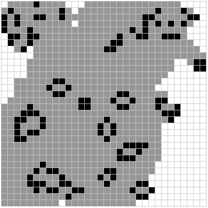

# GA of Life

A web application that lets you run a Genetic Algorithm (GA) to solve optimization problems in
Conway's Game of Life, a Cellular Automaton (CA).

I developed it purely for my own enjoyment and learning.
It's the first project where I used Rust.
I wanted to see how it can be used to build performant web apps.

The GA tries to find an 8x8 starting position in the grid of the CA that optimizes a configurable
criterion, for example, to cover as much of the grid as possible.
The animation below illustrates the idea.
The cells in gray are currently not alive, but were alive at least once.

You can experiment with the GA and see the resulting CA patterns [here](https://erwinbonsma.github.io/www/ga-of-life/).
The [help page](https://erwinbonsma.github.io/www/ga-of-life/#/help) provides a bit more detail.

## CA implementation

In order to maximise performance, the Game of Life rules are implemented by performing bitwise operations.
This is based on [Game of Life by rilden](https://www.lexaloffle.com/bbs/?pid=94115) implemented in
[PICO-8](https://www.lexaloffle.com/pico-8.php).

## Technologies

* HTML5/CSS
* Javascript
* [ReactJS](https://reactjs.org) + [React Bootstrap](https://react-bootstrap.github.io)
* Rust
* Web Assembly

## License

Evolving Life is licensed under a
Creative Commons Attribution-NonCommercial-ShareAlike 4.0 International License.

You should have received a copy of the license along with this
work. If not, see <http://creativecommons.org/licenses/by-nc-sa/4.0/>.